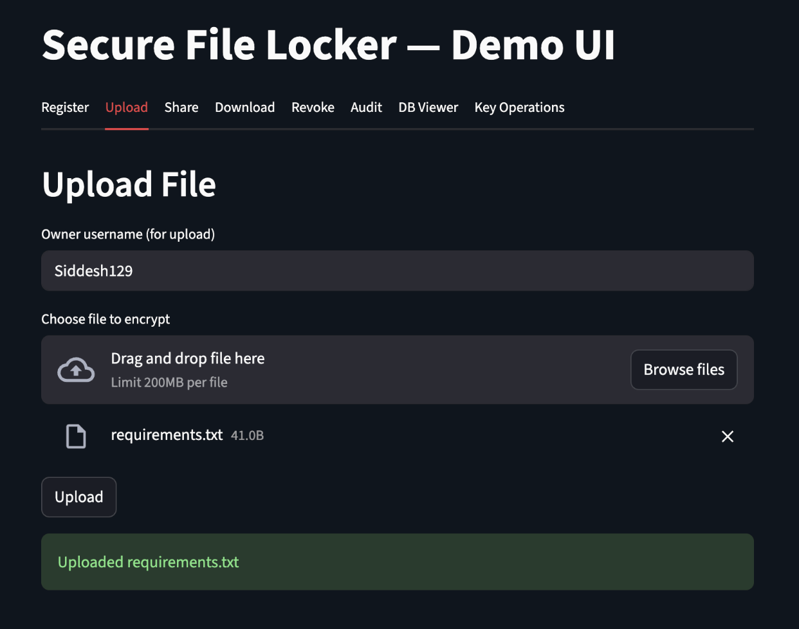

# Secure File Locker with Fine-Grained Access Control
---------------------------------------------------
## Overview

Secure File Locker is a secure file storage and sharing system designed for untrusted environments. All cryptographic operations are performed locally, ensuring that plaintext data and secret keys never leave the user’s control.

The system supports secure file encryption, fine-grained sharing, instant access revocation, and a tamper-evident audit log, while offering a transparent and educational cryptographic workflow through an interactive interface.


## Key Features

- End-to-End Encryption using AES-GCM

- Per-User Key Exchange via X25519 (Elliptic-Curve Diffie–Hellman)

- Fine-Grained File Sharing with per-recipient wrapped keys

- Instant Access Revocation without re-encrypting files

- Tamper-Evident Audit Log using a hash-chained structure

- Interactive Streamlit UI for visualizing cryptographic operations

## System Architecture
1️⃣ User Registration
- Each user generates an X25519 key pair
- Public keys are stored in the database
- Private keys are encrypted using a password-derived key

2️⃣ File Encryption
- A unique AES-GCM key is generated per file
- Files are encrypted locally before storage
- No plaintext files are ever stored on disk

3️⃣ Secure Sharing & Revocation
File keys are wrapped individually for each recipient using:
- X25519 shared secret
- HKDF-derived wrapping key
- Revocation removes the wrapped key instantly, cutting off access

4️⃣ Tamper-Evident Audit Log
- Every operation is logged
- Each log entry includes the hash of the previous entry
- Any modification breaks the integrity chain

🖥️ User Interface
- The Streamlit-based UI allows users to:
- Register and manage cryptographic keys
- Upload, share, download, and revoke files
- Visualize key wrapping and unwrapping
- Verify audit log integrity in real time

## Novelty

Demonstrates real-world cryptographic key wrapping in an interactive setting

Uses a lightweight hash chain instead of blockchain for auditability

Provides a GUI-driven cryptographic workflow for education and demonstration

Models production-grade access control with modular and extensible design

Here’s the clean, simple, step-by-step guide to run Secure File Locker
---
1. Extract the ZIP
Unzip the submission:
```
Final-Project/
```
You’ll see:
```
streamlit_app.py
src/
requirements.txt
eval_results.csv
```
---
2. Create a Virtual Environment(Not necessary, but good use)
On macOS / Linux:
```bash
python3 -m venv venv
source venv/bin/activate
```
On Windows:
```cmd
python -m venv venv
venv\Scripts\activate
```
---
3. Install Dependencies
Run:
```bash
pip install -r requirements.txt
```
This installs:
* Streamlit
* cryptography
* SQLAlchemy (if included)
* Dependencies for the crypto backend
*IF SOMETHING IS STILL MISSING, PLEASE INSTALL*
---
4. Initialize the Database (only needed once)
Run this:
```bash
python -c "from src.db import init_db; init_db()"
```
This creates:
```
src/sfl.db
```
with tables for:
* users
* files
* ACL
* audit logs
---
5. Start the Streamlit UI
Run:
```bash
streamlit run streamlit_app.py
```
Streamlit will open automatically in your browser at:
```
http://localhost:8501
```
---
How to Use the App
1. Register Users (Use user1(owner) & user2(requester))
Go to the Register tab:
Enter username → click Register
This generates:
* X25519 private key
* X25519 public key
Keys are stored in the DB.
---
2. Upload & Encrypt a File
Go to Upload File:
Enter owner username
* Upload any file
* System generates AES-GCM key
* File key gets wrapped with owner’s public key
* File is stored encrypted
---
3. Share Access
Go to Share File:
* Owner username
* Target username
* Filename
System:
* Unwraps file key using owner's private key
* Re-wraps it for target user
* Updates DB
---
4. Download and Decrypt
Go to Download File:
* Enter your username
* Enter filename
* Click Download
If you have permission:
* File key unwraps
* File decrypts locally
* Browser downloads plaintext
---
5. Revoke Access
Go to Revoke Access:
* Owner
* Target user
* Filename
Removes target’s wrapped key entry.
---
6. Audit Log
Go to Audit Log:
* View all actions
* Verify hash chain integrity
* Detect any tampering
---
